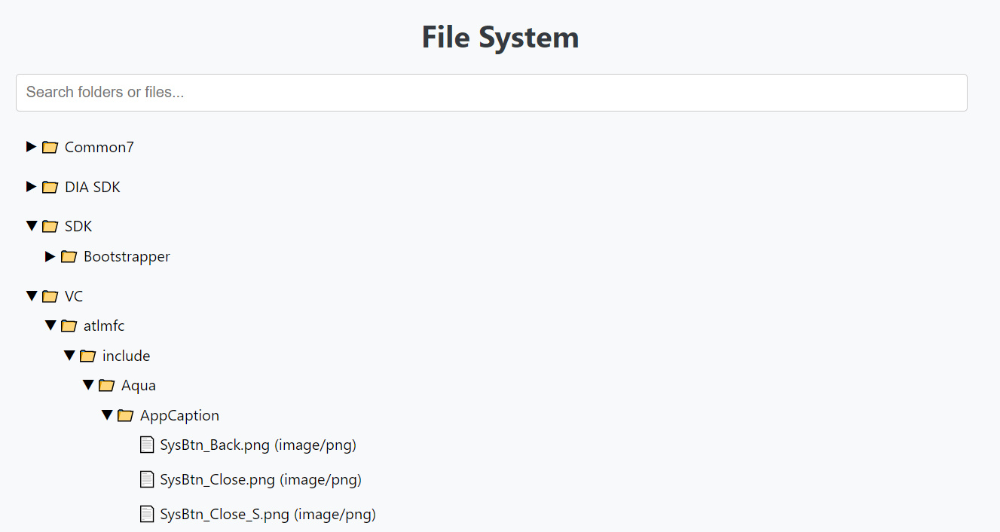

# Erizos test task 3

Optimization:

- search debounce with 400ms when entering text into the search bar, cancels the call if you quickly enter another letter
- memoize function for caching search results for a specific query
- Jest tests with expandedFolders parameter to test the structure
- ESLint is configured to maintain code quality and consistency
- Everything is splited into small class components

## Preview



> All data from the Data.json file

### Installation

1. Clone the repo
   ```sh
   git clone https://github.com/favrora/test-tasks.git
   ```
2. Open project folder
   ```sh
   cd task3
   ```
3. Install NPM packages
   ```sh
   npm install
   ```
4. Build and run app:
   ```sh
   npm run start
   ```
5. App will run here => [http://localhost:3000](http://localhost:3000)
